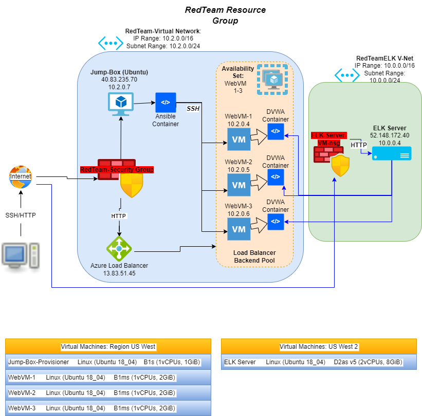

## Automated ELK Stack Deployment

The files in this repository were used to configure the network depicted below.

These files have been tested and used to generate a live ELK deployment on Azure. They can be used to either recreate the entire deployment pictured above. Alternatively, select portions of the _____ file may be used to install only certain pieces of it, such as Filebeat.

 [/etc/ansible/install-elk.yml](Ansible/install-elk.yml)

This document contains the following details:
- Description of the Topology
- Access Policies
- ELK Configuration
  - Beats in Use
  - Machines Being Monitored
- How to Use the Ansible Build

### Description of the Topology

The main purpose of this network is to expose a load-balanced and monitored instance of DVWA, the D*mn Vulnerable Web Application.

Load balancing ensures that the application will be highly available, in addition to restricting traffic to the network.
- What aspect of security do load balancers protect? 
  - Load Balancers help mitigate the risk of (DDoS) Denial-of-Service attacks by shifting to another server.
- What is the advantage of a jump box?
  - The advantage of a Jump Box forces all of the traffic to a single node. This Jump Box requires SSH for added security. All administrative tasks are done within this VM to manage/configure other VM's and containers.

Integrating an ELK server allows users to easily monitor the vulnerable VMs for changes to the _____ and system _____.
- What does Filebeat watch for?
  - Filebeat monitors the specified log files or locations; collects log events, and send them to Elasticsearch.
- What does Metricbeat record?
  - Metricbeat is lightweight that periodically records metric from the OS and from services currently running on the (specified) server. It takes the statistics and metrics that it collects and forwards them to Elasticsearch.

The configuration details of each machine may be found below.

| Name     | Function | IP Address | Operating System |
|----------|----------|------------|------------------|
| Jump Box | Gateway  | 10.2.0.7   | Linux (Ubuntu 18.04) |
| WebVM-1  | DVWA     | 10.2.0.4   | Linux (Ubuntu 18.04) |
| WebVM-2  | DVWA     | 10.2.0.5   | Linux (Ubuntu 18.04) |
| WebVM-3  | DVWA     | 10.2.0.6   | Linux (Ubuntu 18.04) |
| ELK      | ELK      | 10.0.0.4   | Linux (Ubuntu 18.04) |

### Access Policies

The machines on the internal network are not exposed to the public Internet. 

Only the Jump-Box machine can accept connections from the Internet. Access to this machine is only allowed from the following IP addresses:
- Personal IP Address (Can be found using ip4.me)

Machines within the network can only be accessed by SSH port 22.
- The Jump-Box from private IP 10.2.0.7

A summary of the access policies in place can be found in the table below.

| Name     | Publicly Accessible | Allowed IP Addresses |
|----------|---------------------|----------------------|
| Jump Box | Yes                 | Personal IP          |
| WebVM-1  | No                  | 10.2.0.7             |
| WebVM-2  | No                  | 10.2.0.7             |
| WebVM-3  | No                  | 10.2.0.7             |
| ELK      | No                  | 10.2.0.7 & Personal IP|  

### Elk Configuration

Ansible was used to automate configuration of the ELK machine. No configuration was performed manually, which is advantageous because...
- It is used to scale automation on multiple machines using a Playbook and not having a risk of creating errors by manually configuring each virtual machine.

The playbook implements the following tasks:
- The header of the Playbook can specify which group of machines it is applying to and the remote user.
- The Playbook install the following services:
  - docker.io
  - python3-pip
  - docker
- To launch and expose the container `run sebp/elk:761`
  - The container should be started with the published ports:
    - 5601:5601 9200:9200 5044:5044

The following screenshot displays the result of running `docker ps` after successfully configuring the ELK instance.

### Target Machines & Beats
This ELK server is configured to monitor the following machines:
- WebVM-1 10.2.0.4
- WebVM-2 10.2.0.5
- WebVM-3 10.2.0.6

We have installed the following Beats on these machines:
- Filebeat
- Metricbeat

These Beats allow us to collect the following information from each machine:
- _TODO: In 1-2 sentences, explain what kind of data each beat collects, and provide 1 example of what you expect to see. E.g., `Winlogbeat` collects Windows logs, which we use to track user logon events, etc._

### Using the Playbook
In order to use the playbook, you will need to have an Ansible control node already configured. Assuming you have such a control node provisioned: 

SSH into the control node and follow the steps below:
- Copy the _____ file to _____.
- Update the _____ file to include...
- Run the playbook, and navigate to ____ to check that the installation worked as expected.

_TODO: Answer the following questions to fill in the blanks:_
- _Which file is the playbook? Where do you copy it?_
- _Which file do you update to make Ansible run the playbook on a specific machine? How do I specify which machine to install the ELK server on versus which to install Filebeat on?_
- _Which URL do you navigate to in order to check that the ELK server is running?

_As a **Bonus**, provide the specific commands the user will need to run to download the playbook, update the files, etc._
